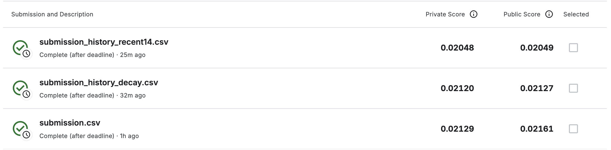
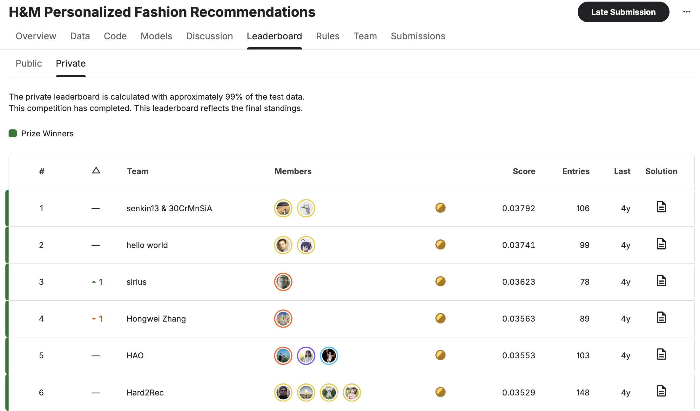

# Multimodal Fashion Recommender System

Мультимодальная рекомендательная система для fashion-рекомендаций на датасете **H&M Personalized Fashion Recommendations**.

В проекте последовательно исследуются простые и более сложные подходы: от popularity-baseline и истории покупок до BPR, SASRec, временно-затухающей популярности, визуальных CLIP-эмбеддингов и итогового гибридного ранжирования.

---

## Датасет

Используется датасет соревнования Kaggle:

**H&M Personalized Fashion Recommendations**

Ссылка:

https://www.kaggle.com/competitions/h-and-m-personalized-fashion-recommendations

Основные исходные файлы:

```text
articles.csv
customers.csv
transactions_train.csv
sample_submission.csv
images/
```

Исходные данные и изображения не хранятся в Git-репозитории из-за большого объёма.

Подробнее о структуре данных:

[`data/README.md`](data/README.md)

---

## Постановка задачи

Для каждого пользователя необходимо сформировать список из **12 товаров**, которые он с наибольшей вероятностью купит в будущем.

В проекте используются четыре основных типа информации:

1. история покупок пользователя;
2. глобальная и временно-затухающая популярность товаров;
3. последовательность взаимодействий пользователя;
4. визуальная информация из изображений товаров.

---

## Схема экспериментов

Эксперименты проводились последовательно:

```text
EDA
↓
Preprocessing
↓
Popularity baselines
↓
Personal history
↓
BPR collaborative filtering
↓
SASRec
↓
Decay popularity
↓
Hybrid recommender
↓
Metadata-aware SASRec
↓
CLIP visual retrieval
↓
Final hybrid
↓
Temporal test
↓
Kaggle submissions
```

Для offline-оценки используется временное разбиение, чтобы не допустить утечки информации из будущего.

Основная схема:

```text
Train:      t_dat < 2020-09-09
Validation: 2020-09-09 <= t_dat < 2020-09-16
Test:       t_dat >= 2020-09-16
```

Validation используется для выбора подходов и весов гибрида.

Test остаётся отдельной более поздней temporal-выборкой и используется только для финальной offline-проверки.

---

## Модели

### 1. Popularity baselines

Проверяются простые неперсонализированные рекомендации самых популярных товаров:

- Global popularity;
- Recent popularity 7d;
- Recent popularity 14d;
- Recent popularity 28d;
- Recent popularity 56d.

Эти модели используются как базовая точка сравнения.

---

### 2. Personal History

Для каждого пользователя берутся последние уникальные товары из его собственной истории покупок.

Если истории недостаточно, список дополняется популярными товарами.

Этот подход оказался очень сильным baseline для данного датасета.

---

### 3. BPR Collaborative Filtering

В качестве collaborative filtering модели используется **Bayesian Personalized Ranking**.

Обучаются embedding-векторы пользователей и товаров с pairwise-целью:

```text
score(user, positive_item) > score(user, negative_item)
```

BPR даёт персонализированные рекомендации на основе взаимодействий пользователей и товаров.

---

### 4. SASRec

Для последовательного моделирования используется **SASRec**.

Основные компоненты:

- item embeddings;
- positional embeddings;
- Transformer Encoder;
- causal attention;
- next-item prediction.

SASRec учитывает не только факт покупки, но и порядок взаимодействий пользователя.

---

### 5. Decay Popularity

Для popularity-сигнала добавляется временное затухание:

```text
weight = 2 ^ (-age_days / half_life)
```

Чем старше покупка, тем меньше её вклад в текущую популярность товара.

На validation подбирался `half_life`.

DecayPop оказался сильнее обычной recent popularity и вошёл в итоговый гибрид.

---

### 6. Metadata-aware SASRec

В SASRec дополнительно добавлялись категориальные признаки товаров:

```text
product_type_no
graphical_appearance_no
colour_group_code
perceived_colour_value_id
perceived_colour_master_id
department_no
index_group_no
section_no
garment_group_no
```

Для каждого признака создаётся отдельный embedding, после чего metadata-представление объединяется с item representation.

Также отдельно исследовался cold-start.

Эксперименты показали, что metadata сама по себе не решает проблему unseen-items, но позволяет оценить дополнительный content-сигнал.

---

### 7. CLIP Visual Retrieval

Для изображений товаров используются визуальные embedding-векторы модели:

```text
openai/clip-vit-base-patch32
```

Размерность embedding:

```text
512
```

Для пользователя строится визуальный профиль на основе изображений ранее купленных товаров.

Проверялись:

- mean visual profile;
- recency-weighted visual profile.

Recency-weighted профиль оказался лучше простого среднего.

Лучший standalone visual result на validation:

```text
MAP@12 ≈ 0.01225
```

Visual retrieval отдельно слабее history-based подхода, но даёт дополнительный сигнал для гибрида.

---

## Итоговый гибрид

Финальная система объединяет:

1. Personal History;
2. SASRec;
3. DecayPop;
4. CLIP Visual Retrieval.

Используется weighted rank fusion.

Финальные веса, выбранные на validation:

```text
History weight = 1.00
SASRec weight  = 0.12
Decay weight   = 0.08
Visual weight  = 0.07
```

То есть основой остаётся личная история пользователя, а остальные модели корректируют итоговый ranking.

---

## Метрики

Основная метрика:

```text
MAP@12
```

Дополнительно считаются:

```text
Recall@12
NDCG@12
Coverage
```

### MAP@12

Mean Average Precision учитывает не только наличие релевантных товаров, но и позиции, на которых они были рекомендованы.

### Recall@12

Показывает, какая доля релевантных товаров попала в top-12.

### NDCG@12

Учитывает порядок релевантных элементов: попадания ближе к началу списка имеют больший вес.

### Coverage

Показывает, какую долю каталога система реально использует в рекомендациях.

---

## Результаты

### Validation

Финальный гибрид:

| Метрика | Значение |
|---|---:|
| MAP@12 | 0.027367 |
| Recall@12 | 0.056281 |
| NDCG@12 | 0.039973 |
| Coverage | 0.243676 |

### Temporal test

| Метрика | Значение |
|---|---:|
| MAP@12 | 0.026336 |
| Recall@12 | 0.055940 |
| NDCG@12 | 0.038485 |
| Coverage | 0.328230 |

Validation и test находятся достаточно близко друг к другу, поэтому итоговый гибрид не показывает резкого падения качества на следующем временном периоде.

---

## Kaggle

После offline-экспериментов были сформированы несколько submission-вариантов.

| Submission | Public Score | Private Score |
|---|---:|---:|
| History 56d + RecentPop 14d | 0.02049 | 0.02048 |
| History 56d + DecayPop | 0.02127 | 0.02120 |
| **Final multimodal hybrid** | **0.02161** | **0.02129** |

### Мои submissions



Итоговый multimodal hybrid показывает лучший результат среди трёх загруженных вариантов и на Public, и на Private части.

### Контекст leaderboard



На скриншоте верхние результаты соревнования находятся примерно в диапазоне:

```text
0.035–0.038
```

Лучший score на показанном leaderboard:

```text
0.03792
```

Поэтому значение около `0.02` в этой задаче нельзя интерпретировать как «очень низкое».

### Решение победителей

Победители соревнования использовали двухэтапную схему: генерацию кандидатов и последующее ранжирование с помощью LightGBM и CatBoost.

Интересно, что их подход в основном опирался не на сложные нейросетевые модели, а на сильные признаки и градиентный бустинг. В обсуждении автор решения отдельно отметил, что технология должна выбираться под задачу, а не просто потому, что она выглядит более современной.

[1st place solution](https://www.kaggle.com/competitions/h-and-m-personalized-fashion-recommendations/writeups/senkin13-30crmnsia-1st-place-solution)

---

## Структура проекта

```text
multimodal-fashion-recsys/
├── assets/
│   ├── kaggle_leaderboard.png
│   └── kaggle_submissions.png
│
├── data/
│   └── README.md
│
├── notebooks/
│   ├── 01_data_exploration.ipynb
│   ├── 02_preprocessing.ipynb
│   ├── 03_baselines.ipynb
│   ├── 04_collaborative_filtering.ipynb
│   ├── 05_sasrec.ipynb
│   ├── 06_decay_popularity.ipynb
│   ├── 07_hybrid_recommender.ipynb
│   ├── 08_metadata_sasrec.ipynb
│   ├── 09_visual_embeddings.ipynb
│   ├── 10_final_hybrid.ipynb
│   ├── 11_final_evaluation.ipynb
│   ├── 12_kaggle_submission.ipynb
│   └── 13_ablation_submissions.ipynb
│
├── .gitignore
├── LICENSE
├── README.md
└── requirements.txt
```

Крупные и генерируемые артефакты не хранятся в Git:

```text
data/raw/
data/processed/
checkpoints/
embeddings/
submissions/
```

---

## Ноутбуки

| № | Ноутбук | Что происходит |
|---:|---|---|
| 01 | `01_data_exploration.ipynb` | EDA исходного H&M dataset |
| 02 | `02_preprocessing.ipynb` | preprocessing, ID mapping, temporal split |
| 03 | `03_baselines.ipynb` | popularity и personal-history baselines |
| 04 | `04_collaborative_filtering.ipynb` | BPR collaborative filtering |
| 05 | `05_sasrec.ipynb` | обучение SASRec |
| 06 | `06_decay_popularity.ipynb` | time-decayed popularity |
| 07 | `07_hybrid_recommender.ipynb` | первый hybrid и подбор весов |
| 08 | `08_metadata_sasrec.ipynb` | metadata-aware SASRec и cold-start |
| 09 | `09_visual_embeddings.ipynb` | CLIP embeddings и visual retrieval |
| 10 | `10_final_hybrid.ipynb` | финальный multimodal hybrid |
| 11 | `11_final_evaluation.ipynb` | независимая temporal test-оценка |
| 12 | `12_kaggle_submission.ipynb` | создание final Kaggle submission |
| 13 | `13_ablation_submissions.ipynb` | ablation submissions для Kaggle |

---

## Установка

Создать окружение:

```bash
python -m venv .venv
```

Активировать на macOS/Linux:

```bash
source .venv/bin/activate
```

Установить зависимости:

```bash
pip install -r requirements.txt
```

---

## Запуск

Ноутбуки рассчитаны на последовательный запуск.

Начало:

```text
01_data_exploration.ipynb
02_preprocessing.ipynb
```

После preprocessing создаются необходимые mapping и parquet-файлы.

GPU особенно полезен для:

```text
05_sasrec.ipynb
08_metadata_sasrec.ipynb
09_visual_embeddings.ipynb
```

Остальные этапы после сохранения промежуточных артефактов в основном могут выполняться на CPU.

Основная часть обучения проводилась в Google Colab на NVIDIA T4.

---

## Основные выводы

По итогам экспериментов:

- простой personal history оказался очень сильным baseline;
- обычная global popularity заметно слабее персонализированных рекомендаций;
- time decay улучшает popularity-сигнал;
- SASRec добавляет последовательную информацию о поведении пользователя;
- BPR и SASRec сами по себе не превосходят сильный history-based baseline;
- metadata не решила cold-start в текущей реализации;
- CLIP visual retrieval отдельно слабее behavioral моделей;
- визуальный сигнал всё же улучшает final hybrid;
- лучший результат достигается объединением нескольких разных источников информации.

Главный вывод проекта:

> Более сложная модель не обязательно должна полностью заменять сильный простой baseline. В этой задаче лучший результат получился при объединении personal history, sequential, temporal и visual сигналов.
